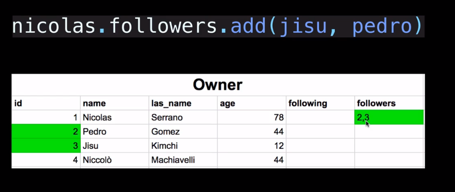

# # 1-20 Creating the Image Model

>[Model field reference](https://docs.djangoproject.com/es/1.10/ref/models/fields/#field-types)

* AbstractModel  
데이터베이스에 연결되지 않지만, 다른 Model들의 Base를 깔아주는 Model. 반복코드 작성을 피하기위한 **일종의 blueprint**
* `abstract=True` in the Meta class.  
This model will then not be used to create any database table. Instead, when it is used as a base class for other models  
* `auto_now_add` / `auto_now`  
Save data automatically to the model when `created / updated`
```python
# images/models.py
from django.db import models

class TimeStampedModel(models.Model):

    # Save automatically
    created_at = models.DateTimeField(auto_now_add=True)
    updated_at = models.DateTimeField(auto_now=True) 
    
    class Meta:
        abstract = True # AbstractModel로 설정

class Image(TimeStampedModel):

    file = models.ImageField()
    location = models.CharField(max_length=140)
    caption = models.TextField()

class Comment(TimeStampedModel):

    message = models.TextField()
```
-> Image Model 작성후 Migration !

---

# # 1-21. Model Relationships

## ForeignKey
>[문서](https://docs.djangoproject.com/en/1.11/ref/models/fields/#django.db.models.ForeignKey)

* 다른 모델의 ID를 저장하여 관계를 만들어주는 Key
* The ID field of a related model
* pk(primary key): 장고의 ID를 의미함 (=id)
* 필드가( )가 비워져있으면 안됨 -> `null=True`를 디폴트로 채워준다  
ex. `owner = models.ForeignKey(Owner, null=True)`
```python
class Cat(models.Model):
    name = models.CharField(max_length=30)
    owner = models.ForeignKey(Owner, pk=2) # Owner모델의 pk2와 연결
```
### # “backward” relationships
ForeignKey로 관계를 형성한 모델에, 역으로 관계를 형성해 참조할 수 있도록 해주는 방법
* `ForeignKey.related_name`  
: The name to use for the relation from the related object back to this one
* `null=True`  
: null=True is required to avoid unique constraint violations when saving multiple objects with blank values
```python
class Image(TimeStampedModel):

    """ Image Model """

    file = models.ImageField()
    location = models.CharField(max_length=140)
    caption = models.TextField()
    creator = models.ForeignKey(
        user_models.User, # Create relationship between User and Image
        related_name='images' # Create backward relationship to User
        related_query_name="image",
        null=True,
        on_delete=models.PROTECT # required in Django 2.0
    )
```
1. Image에서 creator변수를 만들기위해 User모델과 연결
2. User모델에 역으로 Image모델과의 관계를 생성
3. User모델안에 image변수가 없지만 참조할 수 있게됨  
ex. following한 유저가 업로드한 images를 User모델에서 호출가능해짐

## _set 속성
* 관련된 모든 object들을 그룹화하는 속성
* `모델이름_set`으로 호출
* DB에 칼럼생성 X
```python
nicolas = Owner.objects.get(id=1)
nico_cats = nicolas.cat_set.all() ## nico의 모든 고양이
```

## Many To Many
>ex.  
>Cats have `ForeignKey` to Owner.  
>Owner has ManyToMany to himself (=많은 고양이들을 소유)

* Many Users Follow Many Users (relationship)
* DB에 칼럼생성 O
* 필드( )가 비워져있어도됨 (빈 칼럼)

```python
class User(AbstractUser):
    
    ...생략
    
    followers = models.ManyToManyField("self")
    following = models.ManyToManyField("self")
    
```


---

# # 1-22 Created the Like model

* ForeignKey는 ManyToOne / OneToMany의 의미로 볼 수 있다
* import시 models 중복이생기면 오류가 생길 수 있어 `user_models`같은 닉네임을 지정해준다.
```python
# images/models.py
from django.db import models
from bongstagram.users import models as user_models # 닉네임생성 

class Like(TimeStampedModel):

    creator = models.ForeignKey(user_models.User, on_delete=models.PROTECT, null=True)
    image = models.ForeignKey(Image, on_delete=models.PROTECT, null=True)
```

---
# #1-24 Registering the Models in the admin

## `@` 데코레이터
* 선언할 함수 앞에 `@decorator`를 붙여 본체를 꾸며준다(=기능을 더해준다)
* 로그를 남기거나 유저의 로그인 상태등을 확인하여 로그인 상태가 아니면 로그인 페이지로 리더랙트(redirect)하기 위해서 많이 사용된다
* `@admin.register(...)`  
ModelAdmin class를 등록하기 위한 데코레이터
```python
from django.contrib import admin
from . import models

@admin.register(models.Image)
class ImageAdmin(admin.ModelAdmin):
    pass
```
Image Model 속성을 가지고있는 ImageAdmin class를 등록

---
# #1-25 Customizing the Django Admin

## `__str__`
string representation. 텍스트를 어떻게 보이게할 지 설정하는 메소드

```python
# images/models.py

class Image(TimeStampedModel):

    file = models.ImageField()
    location = models.CharField(max_length=140)
    caption = models.TextField()
    creator = models.ForeignKey(user_models.User, on_delete=models.PROTECT, null=True)
    # represent filename (ex. screenshot02.png)

    def __str__(self):
        return '{} - {}'.format(self.location, self.caption)
    # repersent image's "location-caption" (ex. Gangnam - South of Seoul)
```

## Admin패널 커스터마이징

>[ModelAdmin Options](https://docs.djangoproject.com/en/1.11/ref/contrib/admin/#django.contrib.admin.ModelAdmin.list_display)

* `list_display_links`: 이미지 수정 페이지링크
* `search_field`: 검색창. 검색어 설정가능
* `list_filter`
* `list_display`:리스트를 정렬하는 항목지정

```python 
# images/admin.py 

@admin.register(models.Image)
class ImageAdmin(admin.ModelAdmin):
    
    list_display_links = (
        'location',
    )
    
    search_fields = (
        'location',
        'caption'
    )
    
    list_filter = (
        'location',
        'creator',
    )
    
    list_display = (
        'file',
        'location',
        'caption',
        'creator',
        'created_at',
        'updated_at',
    )
```

---

# # 1-25 HTTP Requests

HTML (HyperText Markup Language): HyperText를 작성하는 언어  
HTTP (HyperText Transfer Protocol): HyperText를 전달하는 프로토콜

* Client - Request
    * Header > Method
        * C  POST
        * R  GET
        * U  PUT
        * D  DELETE
    * Body

* Server - Response  
Request의 Method에 따라 응답함

---

# # 1-26 REST API

> [RESTful API Designing guidelines ](https://hackernoon.com/restful-api-designing-guidelines-the-best-practices-60e1d954e7c9)

