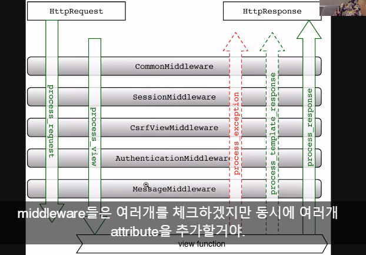

# #1-33 Viewing all the Comments and Likes

Comment에서 Image모델의 ForeignKey가 아닌 이미지를 출력하기위해 시리얼라이징된 이미지 json객체를 불러오도록해준다

```python
# images/serializers.py

class CommentSerializer(serializers.ModelSerializer):

    image = ImageSerializer() # 추가 !
    
    class Meta:
        model = models.Comment
        fields = '__all__' # 시리얼라이징 된 image 반영
```

---

# #1-37 The Request Object in Django

>[Request and response objects](https://docs.djangoproject.com/en/1.11/ref/request-response/)

페이지의 상태를 Django 시스템에 전달하기위해 request, response 오브젝트를 사용한다



1. 웹 페이지에서 request를 받을 때 metadata가 포함된 `HttpRequest`라는 객체를 생성한다 (장고만의 객체. 브라우저가 전달하는 http request와는 다른것)
2. 미들웨어가 여러개 항목을 체크하며 `HttpRequest`객체에 attribute들을 추가한다  
    * `HttpRequest.session`
    * `HttpRequest.user.is_authenticated`(중요)
3. `HttpRequest`객체를 View function의 첫번째 인자로 넘겨 적절한 View을 로드한다
3. 각각의 view는 `HttpResponse`객체를 반환한다

## `HttpRequest` objects
* `HttpRequest.scheme`: http인지 https인지
* `HttpRequest.body`
* `HttpRequest.POST`: (중요) 사진업로드시 모든 데이터를 받음
* `HttpRequest.method`: GET POST DELETE UPDATE...
* `HttpRequest.content_type`: https
* `HttpRequest.Content_Type`: http

---

# #1-38 Making Queries
>-[Making Queries on Django](https://docs.djangoproject.com/en/1.11/topics/db/queries/)  
>-[QuerySet (list of objects) Reference](https://docs.djangoproject.com/en/1.11/ref/models/querysets/)

## Model클래스의 QuerySet
* 문법: `Model.objects.all()`  
* 유용한 메서드: `filter() order_by() value() all()`...

## 예시
* 모든 댓글 가져오기  
`models.Comment.objects.all()`
* 작성자 id3의 댓글 가져오기  
`models.Comment.objects.filter(creator=3)`
* 현재 로그인한 유저의 댓글만 가져오기  
    ```python
    user_id = request.user.id
    comments = models.Comment.objects.filter(creator=user_id)
    ```