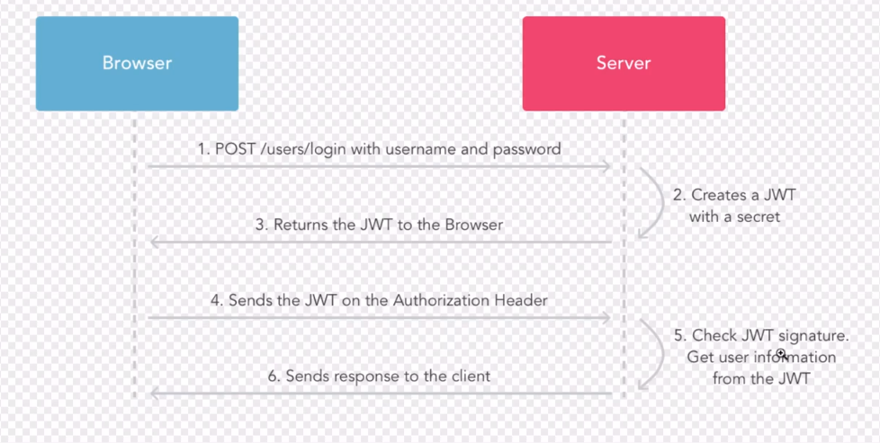
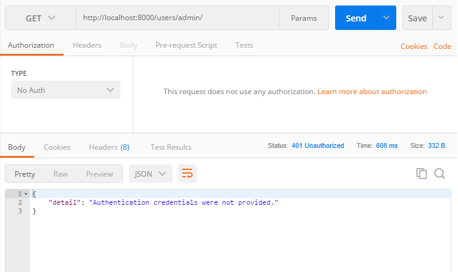
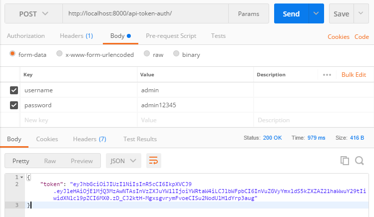
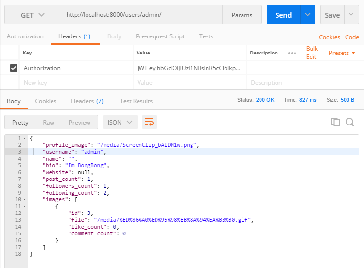

# #1-61 Delete Comment

1. 내가 작성한 댓글 삭제
```python
# images/views.py
class Comment(APIView):
    
    def delete(self, request, comment_id, format=None):
        
        user = request.user
        
        try:
            comment = models.Comment.objects.get(id=comment_id, creator=user)
            comment.delete()
            return Response(status=status.HTTP_204_NO_CONTENT)
        except models.Comment.DoesNotExist:
            return Response(status=status.HTTP_404_NOT_FOUND)
```

2. 내 이미지에 다른사람이 작성한 댓글 삭제
```python
# images/views.py
class ModerateComment(APIView):
    
    def delete(self, request, image_id, comment_id, format=None):
        
        user = request.user
        
        try:
            comment = models.Comment.objects.get(id=comment_id, image__id=image_id, image__creator=user)
            comment.delete()
            return Response(status=status.HTTP_204_NO_CONTENT)
        except models.Comment.DoesNotExist:
            return Response(status=status.HTTP_404_NOT_FOUND)
```

---
# #1-64 Getting the image likes

이미지에 좋아요를 누른 유저 목록

## `.values()` [문서](https://docs.djangoproject.com/en/1.11/ref/models/querysets/#values)
데이터베이스에 저장되있는 object의 모든 key&value를 표시 QuerySet을 나타낸다  
-> ForeignKey에 엮여있는 모델정보, 확장시킨 모델정보...
```python
""" Model Instance """
models.Like.objects.filter(image__id=andy)
#<QuerySet [<Like: User: andy - Image Caption: dfsfsdf>]>

""" dictionaries: key&value for every field in DB """
models.Like.objects.filter(image__id=andy).values()
# <QuerySet [{'updated_at': datetime.datetime(2018, 4, 22, 12, 17, 8, 846948, tzinfo=<UTC>), 'image_id': 10, 'creator_id': 2, 'id': 16, 'created_at': datetime.datetime(2018, 4, 22, 12, 17, 8, 846883, tzinfo=<UTC>)}]
```

---

# #1-65 이미지 업데이트

필수값인 모든 field의 데이터를 채우지 않고 시리얼라이저를 저장(업데이트)하면 에러가난다

* InputImageSerializer를 사용하기위한 필수값 3가지
```python
# images/serializers.py
class InputImageSerializer(serializers.ModelSerializer):
    
    class Meta:
        model = models.Image
        fields = (
            'file',
            'location',
            'caption',
        )
```

* 필수값 file, caption이 없는상태로 업데이트 요청
```js
// Request
PUT {"location": "Gwanggyo"}

// Response
HTTP 400 Bad Request
Allow: GET, PUT, HEAD, OPTIONS
Content-Type: application/json
Vary: Accept

{
    "caption": [
        "This field is required." // 필수값 입력이 필요
    ],
    "file": [
        "No file was submitted."
    ]
}
```

### # 해결방법 1
시리얼라이저에 field별로 필수인지 아닌지 입력  
하지만 이방법은 시리얼라이저 자체를 바꾸는 것이기 때문에, 이미지를 올릴때도 필수값 받는 설정을 변경하게 됨 (사용ㄴㄴ)

***시리얼라이저를 바꾸지는 말자 !!***
```python
# images/serializers.py
class InputSerializer(serializers.ModelSerializer):
    
    file = serializers.FileField(required=False)
    
    class Mata:
        model = models.Image
        fields = (
            'file',
            'location',
            'caption',
        )
```
### # 해결방법 2 Partial Update
[문서](http://www.django-rest-framework.org/api-guide/serializers/#partial-updates)  
PUT Method 사용시 시리얼라이저에 3가지 모든 필드를 작성하지 않아도 괜찮다고 명시

```python
# images/views.py
class ImageDetail(APIView):
    
    # ...
    
    def put(self, request, image_id, format=True):
        
        user = request.user
        
        try:
            image = models.Image.objects.get(id=image_id, creator=user)
        except models.Image.DoesNotExist:
            return Reponse(status=status.HTTP_401_NOT_UNAUTHORIZED)
        
        serializer = serializers.InputSerializer(
            image, data=request.data, partial=True) # Partial Update !
        
        if serializer.is_valid():
            
            serializer.save(creator) # InputSerializer에 빠져있는 creator함께 저장
            
            return Response(data=serializer.data, status=status.HTTP_204_NO_CONTENT)
        else:
            
            return Response(status=status.HTTP_400_BAD_REQUEST)
```

---

#  #1-66 이미지 삭제

## [ForeignKey.on_delete](https://docs.djangoproject.com/en/2.0/ref/models/fields/#django.db.models.ForeignKey.on_delete)
ForeignKey로 참조되고 있는 object를 지울려 할때 행동을 지정해줄 수 있는 인자
* **CASCADE** deletes the object containing the ForeignKey
* **PROTECT** Prevent deletion of the referenced objec
* SET_NULL
* SET_DEFAULT
* SET( )
* DO_NOTHING

### # 예시
Image모델에 ForeignKey로 연결되어있는 Comment, Like모델의
* `on_delete=models.PROTECT`  
Image모델이 Comment, Like로부터 PROTECT설정이 되어있어 이미지를 삭제할 수 없다
* `on_delete=models.CASCADE`  
이미지 삭제 가능 
```python
# images/models.py
class Comment(TimeStampedModel):

    """ Comment Model """
    # ...
    
    image = models.ForeignKey(
        Image,
        related_name='comments',
        null=True, 
        on_delete=models.CASCADE
        # on_delete=models.PROTECT # 이미지 삭제 불가
    )
```

---

# #1-67 Update Profile

```python
# users/views.py

class UserProfile(APIView):
    
    def get_user(self, username):
        
        try:
            found_user = models.User.objects.get(username=username)
            return found_user
        except models.User.DoesNotExist:
            return None
    
    def get(self, request, username, format=None):
        
        # ...
        
    def put(self, request, username, format=None):
        
        user = request.user
        
        found_user = self.get_user(username)
        
        if found_user is None:
            
            return Response(status=status.HTTP_404_NOT_FOUND)
            
        elif found_user.username != user.username:
            
            return Response(status=status.HTTP_401_UNAUTHORIZED)
        
        else:
            
            serializer = serializers.UserProfileSerializer(
                found_user, data=request.data, partial=True)
            
            if serializer.is_valid():
                
                serializer.save()
                
                return Response(data=serializer.data, status=status.HTTP_200_OK)
                
            else:
                
                return Response(data=serializer.data, status=status.HTTP_400_BAD_REQUEST)
```

---

# #1-68 Updating the password
[Check Password Documentation](https://docs.djangoproject.com/en/1.11/ref/contrib/auth/#django.contrib.auth.models.User.check_password)  
비밀번호 변경은 복잡한 로직(현재비밀번호, 변경비밀번호 2회 체크)이 있기때문에, UserProfile의 put(프로필업데이트)와 분리하고 URL도 따로 두도록하자

```python
# users/views.py
class ChangePassword(APIView):
    
    def put(self, request, username, format=None):
        
        user = request.user
        
        # 현재유저와 변경유저가 같은지 여부
        if user.username == username:
            
            current_password = request.data.get('current_password', None)
        
            # 현재비밀번호 입력여부
            if current_password is not None:
                
                password_match = user.check_password(current_password)
                
                # 현재비밀번호 일치여부
                if password_match:
                    
                    new_password = request.data.get('new_password', None)
              
                    # 새로운비밀번호 입력여부
                    if new_password is not None:
                        
                        user.set_password(new_password)
                        
                        user.save()
                        
                        return Response(status=status.HTTP_200_OK)
                        
                    else:
                        
                        return Response(status=status.HTTP_400_BAD_REQUEST)
                
                else:
                    
                    return Response(status=status.HTTP_400_BAD_REQUEST)
                    
            else:
                
                return Response(status=status.HTTP_400_BAD_REQUEST)
            
        else:
            
            return Response(status=status.HTTP_401_UNAUTHORIZED)
```

---

# #1-69 What is JWT

A: Where `request.user` come from?  
Q: 로그인할때 쿠키에 생기는 sessionid를 보고 장고가 유저인증을함 (Network > Cookies > sessionid에서 확인가능)  
```python
# config/settings/base.py
AUTHENTICATION_BACKENDS = [
    'django.contrib.auth.backends.ModelBackend',
    'allauth.account.auth_backends.AuthenticationBackend',
]
```
* 하지만 리액트는 쿠키관리하기가 어려움 & 리액트네이티브(mobile)는 쿠키가 없음
* 장고의 Cookie Authentication말고 json형식 토큰을 쓰도록해야함 -> JWT 

## # JWT(Json Web Token)



1. 설치 [REST framework JWT Auth Installation Instructions](http://getblimp.github.io/django-rest-framework-jwt/)  
`$ pipenv install djangorestframework-jwt`
2. 설정추가  
이전에 장고에서 사용하던 Cookie 승인뿐만아니라 JWT토큰 승인 매커니즘 추가

>많은 승인 매커니즘을 가지고있는게 이상적이다
```python
# config/setting/base.py
REST_FRAMEWORK = {
    'DEFAULT_PERMISSION_CLASSES': (
        'rest_framework.permissions.IsAuthenticated', # 모든 api를 비공개로 변경
    ),
    'DEFAULT_AUTHENTICATION_CLASSES': (
        'rest_framework_jwt.authentication.JSONWebTokenAuthentication', # JWT토큰 승인 
        'rest_framework.authentication.SessionAuthentication', # Cookie 승인도 사용가능
        'rest_framework.authentication.BasicAuthentication',
    ),
}
```

3. jwt url 추가, 쿠키커터가 추가해놓은 불필요한 url 제거
```python
# config/urls.py
from rest_framework_jwt.views import obtain_jwt_token

urlpatterns = [
    # 불필요코드 삭제
    # url(r"^$", TemplateView.as_view(template_name="pages/home.html"), name="home"),
    # url(r"^about/$", TemplateView.as_view(template_name="pages/about.html"), name="about", ),
    
    # Django Admin, use 
    url(settings.ADMIN_URL, admin.site.urls),
    
    # User management
    url(r'^api-token-auth/', obtain_jwt_token), # 추가 !
    url(r"^users/", include("bongstagram.users.urls", namespace="users")),

    # ...
```

## # Postman으로 JWT토큰받기 테스트


1. 인증토큰없이 api요청 -> 실패!  
인증이 필요하다고 응답옴  

2. JWT와 함께 동작하는 api생성  
`http://localhost:8000/users/api-token-auth/`  

3. 헤더에 JWT토큰을 포함하여 api요청 -> 성공!
