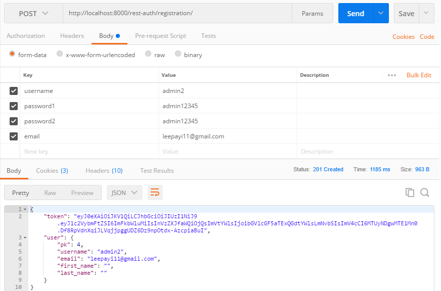
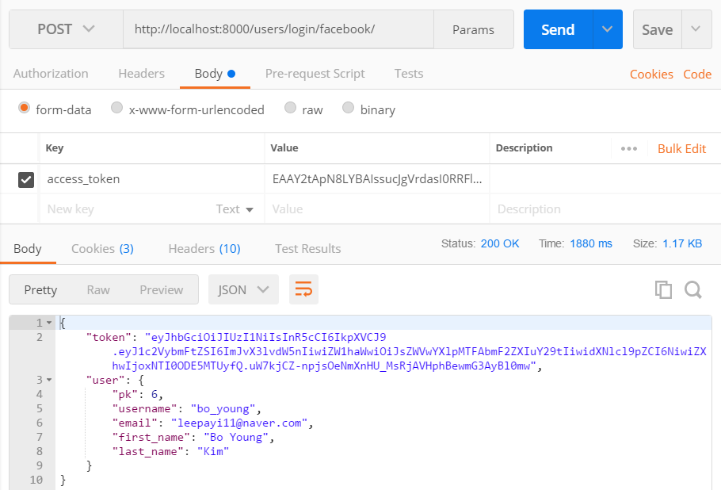

# #1-71 Serializing the Tags
[Django Taggit Rest Serializer](https://github.com/glemmaPaul/django-taggit-serializer)  
1. 설치  
`$ pipenv install django-taggit-serializer`

2. 앱추가
```py
# config/settings/base.py
THIRD_PARTY_APPS = [
    
    #...
    'taggit_serializer', # Tag Serializer
]
```

3. import, 사용하기

```py
# images/serializers.py
from taggit_serializer.serializers import (TagListSerializerField,
                                           TaggitSerializer)

class ImageSerializer(TaggitSerializer, serializers.ModelSerializer):
    
    comments = CommentSerializer(many=True)
    creator = FeedUserSerializer()
    tags = TagListSerializerField() # Tag Serializer
    
    class Meta:
        model = models.Image
        fields = (
            'id',
            'file',
            'location',
            'caption',
            'comments',
            'like_count',
            'creator',
            'tags', # Tag
            'created_at'
        )
```

---

# #1-72 Signing Up : Logging In
[Django Rest Auth Documentation](http://django-rest-auth.readthedocs.io/en/latest/installation.html)  
로그인, 로그아웃, SNS로그인등을 하기위해 사용하는 패키지

## #1. 설치
1. 설치
`$ pipenv install django-rest-auth`

2. 앱추가
```python
# config/settings/base.py
INSTALLED_APPS = (
    ...,
    'rest_framework',
    'rest_framework.authtoken',
    ...,
    'rest_auth'
)
```
```py
# config/urls.py
urlpatterns = [
    ...,
    url(r'^rest-auth/', include('rest_auth.urls'))
]
```

3. 마이그레이션
`$ python manage.py makemigrations && python manage.py migrate`

4. registeration 추가
```py
# config/urls.py
THIRD_PARTY_APPS = [
    # ...
    'rest_auth.registration', # enable registration
]

# ...
REST_USE_JWT = True # JWT도 사용하도록
```

```py
# config/urls.py
urlpatterns = [
    ...,
    url(r'^rest-auth/', include('rest_auth.urls')),
    url(r'^rest-auth/registration/', include('rest_auth.registration.urls'))
]
```
5. rest-auth로그인 사용을위해, 이전에 사용하던 session, basic auth를 삭제
6. [API endpoints](http://django-rest-auth.readthedocs.io/en/latest/api_endpoints.html)설정
    * 로그인 항목 username, email, password중에 email은 필수아니도록 설정
    * REDIRECT 삭제
```py
# config/settings/base.py

# LOGIN_REDIRECT_URL = 'users:redirect' # 삭제

ACCOUNT_EMAIL_REQUIRED = False

#...
REST_FRAMEWORK = {
    'DEFAULT_PERMISSION_CLASSES': (
        'rest_framework.permissions.IsAuthenticated',
    ),
    'DEFAULT_AUTHENTICATION_CLASSES': (
        'rest_framework_jwt.authentication.JSONWebTokenAuthentication',
        # 'rest_framework.authentication.SessionAuthentication', 삭제
        # 'rest_framework.authentication.BasicAuthentication',
    ),
}
```

## #2. API Endpoint 테스트

1. 로그인시도 -> 로그인을위한 토큰과 시리얼라이저가 나옴
```
/rest-auth/login/ (POST)

* username
* email
* password
-> Returns Token key
```


2. 로그아웃시도 -> 토큰사라짐  
    * 편의를위해 로그아웃은 GET방식으로 변경: 버튼하나 클릭해서 로그아웃 될 수 있도록
    * 기술적으론 로그아웃을하면 데이터베이스 shape이 변경되는 거닌깐 POST여야함
```py 
# config/settings/base.py
ACCOUNT_LOGOUT_ON_GET = True # 추가
```

3. 회원가입 시도 -> 새로운유저 생성 & 토큰


---

# #1-73 Uploading a Photo

1. 이미지 Endpoint확인  
http://localhost:8000/images 로 로그인토큰을 헤더에 전송하여 확인


```py
# images/views.py
class Images(APIView):
    
    #...
    def post(self, request, format=None):
        
        user = request.user
        
        serializer = serializers.InputImageSerializer(data=request.data)
        
        if serializer.is_valid():
            
            serialiser.save(creator=user)
            
            return Response(data=serializer.data, status=status.HTTP_201_CREATED)
        
        else:
            return Response(data=serializer.errors, status=status.HTTP_400_BAD_REQUEST)

```

---

# #1-75 Login in with Facebook

쿠키커터가 디폴트로 설치한 all auth덕분에 간단하게 사용가능.

1. 앱추가
```py
# config/settings/base.py
THIRD_PARTY_APPS = [
    'allauth',
    'allauth.account',
    'allauth.socialaccount',
    'allauth.socialaccount.providers.facebook', # 추가
    
    #...
]
```
2. [Facebook Developers](https://developers.facebook.com/)에서 bongstaclone 프로젝트 생성
3. Facebook 로그인 설정 > Web > URL: localhost:8000으로 설정
4. 대시보드에서 APPID, AppSecret을 받아와서, 장고 admin패널 Home › Social Accounts › Social applications 추가
5. view, url생성  
```py
# users/views.py
from allauth.socialaccount.providers.facebook.views import FacebookOAuth2Adapter
from rest_auth.registration.views import SocialLoginView

class FacebookLogin(SocialLoginView):
    adapter_class = FacebookOAuth2Adapter
    
# users/urls.py
urlpatterns += [
    ...,
    url(
        regex=r'^login/facebook/$',
        view=views.FacebookLogin.as_view(),
        name='fb_login',
    ),
]
```
6. [유저 Access Token](https://developers.facebook.com/tools/accesstoken/)을 받아서 포스트맨에서 테스트
